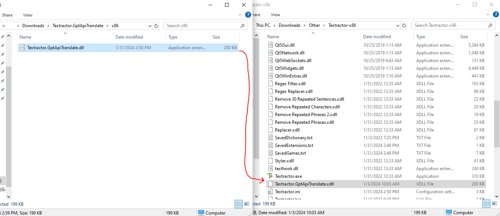
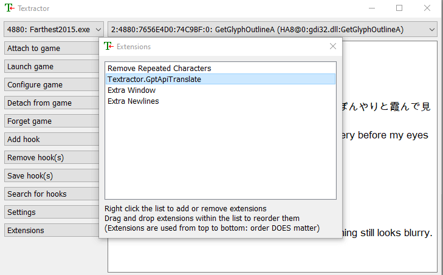
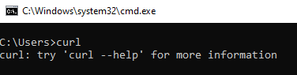
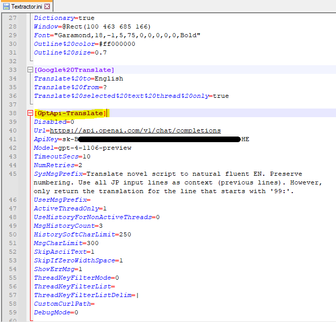

# Textractor.GptApiTranslate

This extension leverages the GPT Completions API to translate text/lines. Later versions of GPT (ex: 4.0) have been shown to have fairly good translation capabilities in comparison to other commonly used translation tools such as Google Translate & DeepL. This is in large part due to GPT's capabilities to take into account context and fine-tuned instructions.

Like the Google Translate extension, this extension will return the original line along with the translated line.


This extention is highly configurable, allowing you to control features such as:
1. GPT model leveraged.
2. Adjustable GPT prompts to fine-tune GPT's behavior.
3. Leveraging past message history to provide additional context for translating lines.
4. Filtering which text hooks/threads to run translations for.
5. Configurable timeout & retry logic for API network requests.
6. Logging GPT API requests for tracing/debugging purposes.
7. The capability to [use another API/endpoint](#how-to-integrate-custom-api-endpoints) similar to GPT (such as Google's Gemini), as of v1.2.


**Note that using the GPT API requires an API key, which much be retrieved from your OpenAI account. OpenAI does charge money for requests to their API.**

**Based on initial testing, using the extension's default configuration, you can expect GPT API costs to range from about $0.75-$2.00 per hour of reading.** *The exact numbers will vary based on several factors such as: model used, reading speed, text density per line, API response times, number of actively translated text hooks, and other extension settings (ex: message history count).* As of mid-2024, using the gpt4-o model would half the estimated cost of the above prediction.

Also note that the GPT API can take a while to return a response compared to other translation services. It is not unexpected for API response times to take anywhere from 0.5 seconds to several seconds.

Unfortunately, it is also not unusual for API requests to hang indefinitely, hence why this extension's timeout and retry settings are crucial to minimize the impact of this.


Specfic GPT API pricing can be found here:
https://openai.com/pricing

In-depth information on the functionality of the GPT Completions API can be found here:
https://platform.openai.com/docs/api-reference/chat


#### How to Use (TL;DR):
1. Download extension (.xdll) and add to root Textractor directory
	- Add any '.dll' files that come with the extension to the root Textractor directory as well.
2. Add extension to Textractor at the right position (*after* text fixes extensions, *before* display extensions)
3. Open Textractor.ini in a text editor, go to extension config section [GptApi-Translate], and set *ApiKey* config value to your OpenAI API key (which you can retrieve from your OpenAI account).
4. Adjust other config values as desired: [Config Values](#config-values)
	- Reference the [Tips](#tips) section for guidance on how to improve translation accuracy, reduce API costs, or reduce response times.

#### How to Retrieve an OpenAI API key:
- You can create/retrieve your OpenAI API key through your OpenAI account.
	- You can log into your OpenAI account here: https://platform.openai.com/login?launch
- If you do not have an OpenAI account, you can register here: https://platform.openai.com/signup
- If you need further assistance on how to retrieve your API key, reference this guide: https://www.howtogeek.com/885918/how-to-get-an-openai-api-key/

<br>


## How to Install
1. Download the latest extension from Releases
    - https://github.com/voidpenguin-28/Textractor-ExtraExtensions/releases
2. Extract the zipped contents and place the '.xdll' extension, as well as any '.dll' files that may come with the extension, in the root directory of the Textractor app.
	- Ensure that the chosen architecture matches the architecture of Textractor.
		- If you are using the x86 version of Textractor, then use the x86 extension
		- If you are using the x64 version of Textractor, then use the x64 extension
	- 
	- As of >= 1.2.2 of this extension, several '.dll' files may come with the extension. These are dependencies that the extension relies on, thus they also need to be copied to the root directory of Textractor.
3. Add the extension to Textractor
	- An extension can be added by opening Textractor, pressing the "Extensions" button, right-clicking the extensions panel, then selecting 'Add extension'.
		- Add the 'Textractor.GptApiTranslate.xdll' from Textractor's root directory.
	- **Once the extension is added, the positioning of the extension in the extension list is important.**
		- Make sure this extension is placed **after** any text fix extensions.
			- Ex: "Remove Repeated Characters", "Remove Repeated Phrases", etc.
		- Also make sure this extension is placed **before** any display-related extensions.
			- Ex: "Extra Window", "Extra Newlines", etc.
		- Also make sure that you are not accidentally using more than one translation extension.
			- Ex: "Google Translate", "DevTools DeepL Translate"
		- An extension's order can be changed by clicking and dragging it.
		- 
4. **This extension relies on *curl.exe* to perform network requests to the GPT API. Ensure that curl is installed on your machine.**
	- **curl** is already installed/available on [all versions of Windows 11] & [Windows 10 ver.1803 or later].
		- Versions of curl pre-packaged with Windows can be found here: C:\Windows\System32\curl.exe
	- A quick way to test if curl is installed/available is to open a command prompt (cmd.exe), then simply type "curl".
		- If curl is found, you should get a message like "*curl: try 'curl --help' for more information*"
		- If curl is not found, you should get a message like "*'curl' is not recognized as an internal or external command,
operable program or batch file.*"
		- 
	- If you do not have curl on your machine, you can download/install it from here: https://curl.se/download.html#Win32
	- If you would like to use a portable version of curl with this extension, you can configure a custom curl path for the extension to use. Reference the [Config Values](#config-values) section of this document for further details.


## How to Use
1. Follow the instructions in the [How to Install](#how-to-install) section to ensure the extension is properly added to Textractor.
2. Once the extension has been added to Textractor, a default config section will be generated/added to the file "Textractor.ini", which you can use to configure this extension.
	- "Textractor.ini" is located in the root directory of the Textrator app and contains most app/extension config values.
	- Open "Textractor.ini" in a text editor (ex: Notepad, Notepad++)
	- The config section for this extension will be *GptApi-Translate*.
		- Ex: \[GptApi-Translate\]
3. Adjust the config section for this extension in the "Textractor.ini" file accordingly.
	- Reference the [Config Values](#config-values) section for each possible value to adjust.
		- The most important config value that must be set is the **ApiKey** value. This extension will not work unless a valid OpenAI API key is set.
	- 


## Tips

### How to Improve Translation Accuracy
Note that many of these recommendations will result in an increase in cost or longer response times.

1. Adjust the model being used ("**Model**" config value)
	- Some GPT models perform better than others. For example, GPT4 will generally perform better than GPT3.5-Turbo.
	- The default model used by this extension is GPT4-O.
	- You may potentially get better results using GPT4 instead of GPT4-Turbo. However, I have not personally tested this myself so I cannot say so with certainty. Also note that GPT4 costs more than GPT4-Turbo.
	- Depending on when in the future you are using this extension, perhaps a newer and better GPT model may exist at that point in time; therefore, you may want to try using whatever is considered the best model at that point in time.
2. Increase the "**MsgHistoryCount**" config value to a higher number.
	- The more previous lines passed in to each GPT request, the more context GPT is able to leverage for translations, thus potentially improving translation quality.
	- Ex: If "**MsgHistoryCount**" is set to 5, then the last 5 lines will be sent to GPT alongside the current line to translate.
3. Increase the "**HistorySoftCharLimit**" or "**MsgCharLimit**" config values.
	- These config values primarily exist to save costs and improve performance, thus increasing their values will lessen their restrictions.
	- If you are noticing that longer sentences have poorer translation quality, then these two config values are the ones you should try increasing/adjusting.
4. Add additional instructions to the "**SysMsgPrefix**" config value.
	- **Note that you should not modify the default sentences in this config value, as they are necessary for the extension to function properly. Generally, you should only modify this config value by adding on more sentences after the default sentences.**
	- The system message directs GPT on how it should behave; therefore, giving additional instructions may help it provide more accurate translations in certain scenarios.
	- Here are some common use cases:
		- *Improving pronoun mapping*. Pronouns can be quite vague in Japanese and thus translations may attribute characters to the wrong pronoun.
			- You can help GPT associate the right pronouns with the right characters by telling GPT the genders of certain characters.
			- For example, if there is a male character named "戦人", you can add '戦人 is male.' to the "**SysMsgPrefix**"
		- *Improving name translations*. Japanese names can sometimes be read in several different ways, making it difficult to know which one is correct.
			- You can help GPT translate a name correctly by informing it of the correct name mapping.
			- For example, if the name "戦人" is "Battler", you can add 'Name 戦人 is Battler.' to the "**SysMsgPrefix**".
		- *Improving consistency with the narrative's point of view*. Related to the pronoun problem with Japanese, it can sometimes be difficult to determine whether a narration is in 1st person or 3rd person.
			- You can help GPT use the correct point of view for translating narration by informing it of the expected point of view.
			- For example, if the story is a 3rd person narrative, you can add 'Narration is 3rd person.' to the "**SysMsgPrefix**".


### How to Reduce Costs & Improve Performance Times

These tips generally involve doing the opposite of the tips for improving translation accuracy. Reducing cost and improving performance times will generally result in a decrease in translation accuracy.

1. Use a cheaper model, such as GPT3.5-Turbo.
2. Decrease the "**MsgHistoryCount**" to a lower value, to reduce the number of past lines sent in each GPT request.
	- The ideal value would be '0', which means that no past lines are sent in the request (only the line to translate gets sent).
3. Decrease the "**HistorySoftCharLimit**" or "**MsgCharLimit**" config values, which may reduce the amount of text sent to GPT in cases of large paragraphs or long lines.
4. Use the default values for "**SysMsgPrefix**" & "**UserMsgPrefix**" to reduce the amount of instructions sent to GPT per request.
5. Ensure the "**ActiveThreadOnly**" config value is set to '1', so that only the active thread/hook is translated.


### How to Integrate Custom API Endpoints

As of v1.2, this extension's configuration allows you to integrate other API endpoints if desired. Here are some basic instructions on how to do so.

1. Set the **Url, ApiKey, Model** config values to your desired API endpoint.
2. Leverage the **CustomRequestTemplate, CustomResponseMsgRegex, CustomErrorMsgRegex, CustomHttpHeaders** config values to integrate the necessary functionality to send API requests and parse API responses.
	- Reference the [Config Values](config-values) section for more details on these config values.

Here are some example integrations
1. **[Google Gemini API](https://ai.google.dev/)**
	- Set the following config values in your ini config.
		```ini
		Url=https://generativelanguage.googleapis.com/v1beta/models/{1}:generateContent?key={0}
		ApiKey=***GEMINI API KEY HERE***
		Model=***DESIRED GEMINI MODEL HERE (ex: gemini-1.5-flash)***
		CustomRequestTemplate={\"systemInstruction\":{\"role\":\"user\", \"parts\":[{\"text\":\"{1}\"}]}, \"contents\":[{\"role\":\"user\", \"parts\":[{\"text\":\"{2}\"}]}], \"safetySettings\":[{\"category\":\"HARM_CATEGORY_SEXUALLY_EXPLICIT\", \"threshold\":\"BLOCK_NONE\"}, {\"category\":\"HARM_CATEGORY_HATE_SPEECH\", \"threshold\":\"BLOCK_NONE\"}, {\"category\":\"HARM_CATEGORY_HARASSMENT\", \"threshold\":\"BLOCK_NONE\"}, {\"category\":\"HARM_CATEGORY_DANGEROUS_CONTENT\", \"threshold\":\"BLOCK_NONE\"}]}
		CustomResponseMsgRegex=\"[Tt]ext\":\\s{0,}\"((?:\\\\\"|[^\"])*)\"
		CustomErrorMsgRegex=
		CustomHttpHeaders=Content-Type: application/json
		```
	- You may want/need to adjust the existing url in the future when changes to the API are made.
		- For example, the current url references the 'v1beta' model version, but in the future you may want to adjust this to a newer version as they become available.
## Config Values
Here is the list of currently supported config values for this extension.

1. **Disabled**: If set to '1', then the functionality of this extension will be disabled (no text will be translated).
	- Default value: '0' (extension is enabled)
2. **Url**: The url tied to the GPT Completion API.
	- Default value: 'https://api.openai.com/v1/chat/completions'
	- **Under normal cirumstances, this value should NOT be modified, or it could result in broken or unexpected behavior.**
		- This config value exists in case a future issue/cirumstance presents itself if OpenAPI ever changed how it structures its API url/path.
	- As of v1.2, this config value also supports templated parameters.
		- This can be useful if you are using a custom API endpoint, or if the existing GPT endpoint somehow changes structure in the future.
		- Supported parameters:
			- {0}: ApiKey
			- {1}: Model
		- Example: https://generativelanguage.googleapis.com/v1beta/models/{1}:generateContent?key={0}
			- The extension will fill in {1} with the Model config value and {0} with the ApiKey config value.
3. **ApiKey**: An OpenAI API key used to authenticate with the GPT Completions API.
	- Default value: '' (none)
	- **This value must be set before this extension can be used, as it is required for making GPT API requests.**
	- You can create/retrieve your OpenAI API key through your OpenAI account.
		- You can log into your OpenAI account here: https://platform.openai.com/login?launch
	- If you do not have an OpenAI account, you can register here: https://platform.openai.com/signup
	- If you need further assistance on how to retrieve your API key, reference this guide: https://www.howtogeek.com/885918/how-to-get-an-openai-api-key/
	- If you are using a custom endpoint/API (ex: Gemini), you would still provide the API key here.
4. **Model**: The GPT model to use for API requests.
	- Default value: 'gpt-4-1106-preview' (GPT-4-Turbo model)
	- This value should be the model value that normally gets passed into the GPT API.
		- Examples:
			- GPT 3.5 Turbo -> "gpt-3.5-turbo"
			- GPT 4 -> "gpt-4"
			- GPT 4 Turbo -> "gpt-4-1106-preview"
		- A full list of available models can be found here (only look at the GPT models): https://platform.openai.com/docs/models/overview
	- Also keep in mind that different models have different pricing and general response times.
		- GPT 3.5 models will be much cheaper and perform faster than GPT 4 models; however, the tradeoff is reduced translation quality/accuracy.
		- API pricing details per model can be found here: https://openai.com/pricing
	- If you are using a custom endpoint/API (ex: Gemini), you would still provide the model to use here.
5. **TimeoutSecs**: The amount of time in seconds that the extension will wait for a GPT API request to complete before cancelling the request.
	- Default value: '10' (10 seconds)
	- If the timeout is reached, then the request will be retried a number of times, based on the value of config key **NumRetries**
6. **NumRetries**: The number of times to retry the API request if the request times-out (based on the value of config key **TimeoutSecs**)
	- Default value: '2' (retry 2 times)
7. **MsgHistoryCount**: The number of previous Japanese lines to send into the GPT request, to use as context for translating the current line to English.
	- Default value: '3' (send last 3 lines to GPT along with current line to translate).
	- One of GPT's biggest advantages over other translation tools is the significantly better capabilities to take context into account for its actions.
		- Therefore, sending the last few Japanese lines alongside the current Japanese line to translate will likely result in a much more accurate and appropriate translation.
	- Under the hood, this extension passes to GPT each line with a numeric index. Index '99' contains the actual line to translate, and the indexes decrement for each previous lines sent in.
		- Ex: (formatted)
			```
			{
				"role":"user", 
				"content":"
					97: 脳一つあれば。
					98: 「あ、なに？」
					99: 少年は我に返る。
				"
			}
			```
		- Only line '99' (少年は我に返る。) will be translated. Lines '97' & '98' are merely used as context to translate line '99'. Line '98' is the line that came before '99', and so on.
8. **SysMsgPrefix**: The text to pass in to the GPT API request as a "system role" message. This is used to give GPT guidance on how to behave and what actions to take; therefore, adjusting this can fine-tune GPT's behavior when translating messages.
	- Default value: "Translate novel script to natural fluent EN. Preserve numbering. Use all JP input lines as context (previous lines). However, only return the translation for the line that starts with '99:'."
		- In other words, the above statement directs GPT to act as a Japanese to English translator. It accepts multiple lines of Japanese text as context but will only translate the last line in the batch (with index '99').
	- Here's a simple formatted example of how this looks in the GPT API request.
		```
		"messages": [
			{
				"role":"system", 
				"content":"
					Translate novel script to natural fluent EN.
					Preserve numbering. Use all JP input lines as context (previous lines).
					However, only return the translation for the line that starts with '99:'.
				"
			}, 
			{
				"role":"user", 
				"content":"
					97: 脳一つあれば。
					98: 「あ、なに？」
					99: 少年は我に返る。
				"
			}
		]
		```
	- **It is highly recommended that you do not modify the default sentences for this key, unless you truly know what you are doing, since they are crucial to the core functionality of the extension.**
		- **If you would like to add additional instructions/behavior to the system, please add the to the end of the existing *SysMsgPrefix* value.**
		- Ex: (formatted)
		```
		[GptApi-Translate]
		;;...omitted...
		SysMsgPrefix=Translate novel script to natural fluent EN. Preserve numbering.
			Use all JP input lines as context (previous lines).
			However, only return the translation for the line that starts with '99:'.
			Please translate the name 戦人 as 'Battler'.
		```
		- Instead of hardcoding the default value into the extension, I decided to give the user the capability to modify the original *SysMsgPrefix* string for more flexibility.
			- For example, it could be useful to modify the default sentences of this config value if you are translating languages other than Japanese and English.
	- In the ini config file, all sentences for this config value should be on the same line.
		```
		[GptApi-Translate]
		;;...omitted...
		SysMsgPrefix=Translate novel script to natural fluent EN. Preserve numbering. Use all JP input lines as context (previous lines). However, only return the translation for the line that starts with '99:'. Please translate the name 戦人 as 'Battler'.
		```
9. **UserMsgPrefix**: Text to prepend to the overall "user role" message passed in to the GPT API request.
	- Default value: '' (empty)
	- The "user role" message in the GPT request will contain the lines of Japanese text to translate and use as context for translations. This config value simply allows you to added a prepended message if desired.
		- In most cases, there will be no need to assign this value. This will ultimately depend on your use case.
	- Here's a simple formatted example of how this looks in the GPT API request, if *UserMsgPrefix* is "Here are the Japanese lines...".
		```
		"messages": [
			{
				"role":"system", 
				"content":"
					Translate novel script to natural fluent EN.
					Preserve numbering. Use all JP input lines as context (previous lines).
					However, only return the translation for the line that starts with '99:'.
				"
			}, 
			{
				"role":"user", 
				"content":"
					Here are the Japanese lines...
					97: 脳一つあれば。
					98: 「あ、なに？」
					99: 少年は我に返る。
				"
			}
		]
		```
		```
		[GptApi-Translate]
		;;...omitted...
		UserMsgPrefix=Here are the Japanese lines...
		```
10. **ActiveThreadOnly**: Indicates if only the current active/selected thread/hook should be translated.
	- Default value: '1' (Active thread/hook only).
	- If this value is set to 0, all threads/hooks will be translated.
	- **Note that translating all threads/hooks will *significantly* increase API costs.**
11. **SkipConsoleAndClipboard**: Allows you to exclude the Console and/or Clipboard threads from being translated.
	- Default value: '1' (skip Console and Clipboard threads)
	- Possible values:
		- **0**: Do not skip Console nor Clipboard threads
		- **1**: Skip both the Console and Clipboard threads
		- **2**: Skip the Console thread (but not the Clipboard thread)
		- **3**: Skip the Clipboard thread (but not the Console thread)
	- This setting applies regardless of the value of the *ActiveThreadOnly* config key.
12. **UseHistoryForNonActiveThreads**: If all threads/hooks are being translated, then this value indicates whether or not to send in previous Japanese lines as context for non-active threads/hooks.
	- Default value: '0' (do not send past lines for non-active threads; only send current line to translate).
	- Note that this config value only applies if the **ActiveThreadOnly** config value is set to '0'.
		- The active thread/hook will always send previous lines as context (based on the *MsgHistoryCount* config value).
	- The number of previous lines sent in for each thread/hook will depend on the config value **MsgHistoryCount**.
	- The primary purpose of this config value is to potentially save on costs and reduce system load.
		- It reduces cost since it significantly cuts down the amount of text sent to GPT for non-active threads/hooks.
13. **HistorySoftCharLimit**: This will restrict the number of past lines passed into GPT, based on the total length of all lines combined.
	- Default value: '250' (do not pass in anymore past lines if total lines length exceeds 250)
	- Note that the length of the actual line to translate is included in this total.
	- Here's an example. Let's say this config value is set to '100' and the **MsgHistoryCount** is set to '3'.
		- Let's say the line to translate (at index '99') is 50 characters long, the previous line (at index '98') is 40 characters long, and the previous line before that (at index '97') is 30 characters long.
		- 50 + 40 + 30 = 120. This exceeds the limit of 100. Therefore, the extension will not include the line at index '97' in the GPT request. It will only include lines '99' and '98', since they are below the limit (50 + 40 = 90; 90 < 100).
		- In other words, only the past 2 lines are sent alongside the current line, despite the *MsgHistoryCount* being set to '3'.
	- Note that the current line to translate (at index '99') will always be sent in to the GPT request, regardless of its length or what this config value is set to.
		- For example, if this config value is set to '50' and the current line to translate is 60 characters long, the full current line will still be sent in regardless.
		- However, in this case no past messages will be sent in (only the line at index '99' will be sent), since the current line's length exceeds the limit.
	- The purpose of this config value is to reduce costs and improve performance in cases where there is a sequence of very long sentences (ex: paragraphs) back to back.
		- The longer a sentence is, the more it will cost you and the longer it may take for GPT to process the request.
14. **MsgCharLimit**: This is the hard limit on how long each Japanese line sent to GPT is capable of being.
	- Default value: '300' (no line can exceed 300 characters).
	- Note that the limit applies to each line, not the total combined length of all lines.
		- In other words, using the default config value as an example, the line at index '99' can be up to 300 chars, the lines at index '98' can be up to 300 chars, etc.
	- If a line exceeds this limit, it will be truncated to match the limit. Characters are trimmed from the beginning of the string, not the end.
		- Ex: If this config value is '10', then line 'ABCDEFGHIJKLMNOP' will be truncated to 'GHIJKLMNOP' before being sent to the GPT request.
15. **SkipAsciiText**: A line will not be translated if it entirely consists of ASCII text (ex: 0-9, a-z, A-Z).
	- Default value: '1' (skip if all ASCII).
	- In other words, the line will simply be left as is.
	- If the line contains even a single non-ASCII character, then the request to GPT will be made.
	- This is just a simple way to potentially reduce the number of GPT requests the extension makes (thus potentially saving on costs).
		- If the line to translate is already in English, then there's no need to send it in to GPT to translate it.
	- If this config value is '0', then the line will still be sent in to GPT, regardless if it is all ASCII.
16. **SkipIfZeroWidthSpace**: A line will not be translated if it contains a zero-width space (unicode character: \x200B).
	- Default value: '1' (skip if contains zero-width space)
	- To give context, you may notice that most translation extensions for Textractor will return both the Japanese and English lines in the same response.
		- Behind the scenes, Textractor distinguishes b/w the Japanese line and the Engilsh line in the text by looking for a zero-width space character, which is used to separate the Japanese and English text from one another.
		- This extension also puts a zero-width space b/w Japanese and English text.
	- Therefore, if this extension finds a line that contains a zero-width space, it will assume that the line has already been translated by another extension, therefore it does not need to be sent to GPT to translate.
	- Ultimately, the point of this config value is to allow you to use more than one translation extension (or a translation cache extension) if desired.
		- If a previous extension already translated the current line, then this extension does not need to translate it.
		- If no zero-width space is found, then it will be assumed that the line still needs to be translated and thus will be sent to GPT.
	- If this config value is set to '0', then a line will be sent to GPT to translate regardless if a zero-width space was found.
17. **ShowErrMsg**: If something goes wrong during the GPT API request, then return the request error message in the sentence.
	- Default value: '1' (show error msg in sentence).
	- Here's an example. Let's first show what a sentence for a successful request would look like:
		```
		少年
		Boy
		```
		- Now let's say this request failed instead, due to an invalid API key. Here is what the sentence would look like instead.
		```
		少年
		Incorrect API key provided: sk-BYySl**************************************sMpH. You can find your API key at https://platform.openai.com/account/api-keys.
		```
		- In other words, the error message is placed where the English translation would normally be, and the Japanese text is returned as normal.
	- If this config value is set to '0', then no error message is returned or shown.
		- Therefore, the request will simply fail in the background.
		- In these cases, only the Japanese line will be returned, no English line.
		- Without any printed error messages, the only way you would be able to get insight into what went wrong would be to set the **DebugMode** config value to '1', and then take a look at the debug log.
18. **CustomRequestTemplate**: Allows you to provide your own request data structure to send to the API endpoint.
	- Default value: '' (blank)
	- Any value you provide here will override the extension's default request template. If this value is blank, then the default request template will be used.
	- **Important note: All double quotation marks must be escaped with a backslash. (aka: Instead of ", you must use \\"**)
		- Unfortunately, this is necessary due to Textractor's ini formatting logic, which is outside the extension's control. Non-escaped double quotation marks will get scrubbed by Textractor when the app is opened or closed.
		- Ex:
		```
		vvv WRONG vvv
		CustomRequestTemplate={"asdf": "1234"}
		
		vvv CORRECT vvv
		CustomRequestTemplate={\"asdf\": \"1234\"}
		```
	- In most cases, setting this value won't be necessary. However, this can be useful in the following scenarios:
		- To integrate a different API similar to GPT (ex: Gemini)
		- In case the existing request template breaks due to a change to the GPT API in the future.
	- This config value supports the following templated parameters:
		- {0}: Model
		- {1}: System Role Message
		- {2}: User Role Message
		- {3}: ApiKey
	- Example (Gemini API): 
		```
		{\"systemInstruction\":{\"role\":\"user\",\"parts\":[{\"text\":\"{1}\"}]},\"contents\":[{\"role\":\"user\",\"parts\":[{\"text\":\"{2}\"}]}]}
		```
		- The extension would fill in {1} with the system role message and {2} with the user role message.
19. **CustomResponseMsgRegex**: Allows you to provide your own custom regex parsing logic to extract the output text from the API response.
	- Default value: '' (blank)
	- Any value you provide here will override the extension's response parsing logic. If this value is blank, then the default response parsing will be used.
	- In most cases, setting this value won't be necessary. The reasons for wanting to use this are the same as the *CustomRequestTemplate* config value.
	- The following conditions must be met for this value to work correctly
		- The string must be a valid regex
			- Note: any '\' characters should be doubled (ex: '\s' should be '\\s')
		- The regex must contain one capture group. The capture group should contain the output text.
			- Your capture group should NOT contain the enclosing quotes for the output text, only the output text itself.
		- **Important note: All double quotation marks must be escaped with a backslash. (aka: Instead of ", you must use \\"**)
			- Unfortunately, this is necessary due to Textractor's ini formatting logic, which is outside the extension's control. Non-escaped double quotation marks will get scrubbed by Textractor when the app is opened or closed.
			- Ex:
			```
			vvv WRONG vvv
			CustomResponseMsgRegex="[Tt]ext":\\s{0,}"((?:\\\\"|[^"])*)"
			
			vvv CORRECT vvv
			CustomResponseMsgRegex=\"[Tt]ext\":\\s{0,}\"((?:\\\\\"|[^\"])*)\"
			```
	- Example:
		```ini
		CustomResponseMsgRegex=\"[Tt]ext\":\\s{0,}\"((?:\\\\\"|[^\"])*)\"
		```
		- API Response: *{"candidates":[{"content":{"parts":[{"text":"99: \\"You're so mean!\\""}],"role":"model"}}]}*
		- Parsed Output: *99: "You're so mean!"*
20. **CustomErrorMsgRegex**: Allows you to provide your own custom regex parsing logic to extract error output text from the API response.
	- Default value: '' (blank)
	- Any value you provide here will override the extension's error parsing logic. If this value is blank, then the default error parsing will be used.
	- This is almost identical to the *CustomResponseMsgRegex* config value. However, many APIs such as GPT return a different JSON response structure when an error occurs, hence why distinct error parsing logic is used.
21. **CustomHttpHeaders**:  Allows you to provide your own HTTP headers to send in the API request.
	- Default value: '' (blank)
	- If you provide a value, then the extension will only use the headers you provide (none of the ones it would use by default). If this value is blank, then the default headers will be used.
	- Each header should be a key-value pair, where the key is the header name and the value is the header value.
		- A ':' delimiter should be used to pair a key to a value.
		- A '|' delimiter should be used to separate each key-value pair.
		- Spaces are acceptable between delimiters, as they will be trimmed out.
	- This config value supports the following templated parameters:
		- {0}: ApiKey
		- {1}: Model
	- Example:
		```ini
		CustomHttpHeaders=Content-Type: application/json | Authorization: Bearer {0}
		```
		- The extension will fill in {0} with the ApiKey.
22. **ThreadKeyFilterMode**: Indicates the filter mode used by the config key "ThreadKeyFilterList"
	- Default value: '0' (disabled)
	- Supported Filter Modes:
		- **0**: Disabled. No filtering will occur, regardless if the "ThreadKeyFilterList" config value is set.
		- **1**: Blacklist mode. Any thread names or thread keys specified in the ThreadKeyFilterList will be excluded from making GPT requests.
		- **2**: Whitelist mode. Only thread names or thread keys specified in the ThreadKeyFilterList will be making GPT requests.
23. **ThreadKeyFilterList**: A list of thread names or thread keys to filter by.
	- For info on what a "ThreadKey" is, reference the following Notes section:
		- https://github.com/voidpenguin-28/Textractor-ExtraExtensions/tree/main/Textractor.TextLogger#notes
	- Note that filtering related config values are usually only relevant when config key **ActiveThreadOnly** is set to '0'.
	- The type of filtering is determined by the "ThreadKeyFilterMode" config value.
	- The list can include both thread keys and thread names.
		- In other words, if thread name "GetGlyphOutlineA" is included in the list, then all thread keys that full under that thread name would be automatically included.
	- Each thread name/key must be separated by the separator/delimiter specified in the "ThreadKeyFilterListDelim" config value.
		-Ex: If "ThreadKeyFilterListDelim" is set to '|', then the 3 threads can be added to the filter list like so: '*GetGlyphOutlineA-1|GetCharABCWidthsA|GetGlyphOutlineA-2*'
24. **ThreadKeyFilterListDelim**: The separator/delimiter to use to distinguish each thread key/name listed in the "ThreadKeyFilterMode" config value.
	- Default value: '|'
	- If you changed this value to ';', then you would have to define the filter list like so: '*GetGlyphOutlineA-1;GetCharABCWidthsA;GetGlyphOutlineA-2*'
25. **CustomCurlPath**: Specifies a custom directory path for where *curl.exe* is located.
	- Default value: '' (blank value indicates to use system curl path)
	- As previously stated, curl is necessary for this extension to perform network requests.
	- By default, this extension uses whatever curl path that is specified by your system's PATH variable.
	- If you would like to use curl from a different location (ex: portable version of curl), then you can specify the directory path where curl is located here.
	- Important notes:
		- Only include the **directory** path, not the curl executable itself.
			- Ex: '*C:/curl-win/*' instead of '*C:/curl-win/curl.exe*'
		- If you use backslashes in your path, **please double the backslashes**
			- Ex: '*C:\\\\curl-win\\\\*' instead of '*C:\\curl-win\\*'
			```ini
			[Textractor.VndbCharNameMapper]
			;;...omitted...
			CustomCurlPath=C:\\curl-win\\
			;;...omitted...
			```
26. **DebugMode**: Allows you to log GPT request and response data to a log file.
	- Default value: '0' (do not log any data to file)
	- Request/response data will be logged to file if this config value is set to '1'.
	- The log file will be called "gpt-request-log.txt" and will be located in the root directory of Textractor.
	- The log will contain:
		- A timestamp for when the request was made.
		- A log level (ex: Info, Error)
		- The full JSON request data sent to GPT.
		- The full JSON response data received from GPT.
	- Log data example:
		```
		[2024-01-03 09:59:24] [ERROR] {"model":"gpt-4-1106-preview","messages":[{"role":"system","content":"Translate novel script to natural fluent EN. Preserve numbering. Use all JP input lines as context (previous lines). However, only return the translation for the line that starts with '99:'."},{"role":"user","content":"98: 「あ、なに？」\n99: 　少年は我に返る。　目の前にいる六人のうち、もっとも小さな個体が、少年……を注視している。"}]}
		{
			"error": {
				"message": "Incorrect API key provided: sk-BYySl**************************************sMpH. You can find your API key at https://platform.openai.com/account/api-keys.",
				"type": "invalid_request_error",
				"param": null,
				"code": "invalid_api_key"
			}
		}
		
		[2024-02-08 10:44:25] [INFO] {"model":"gpt-4-1106-preview","messages":[{"role":"system","content":"Translate novel script to natural fluent EN. Preserve numbering. Use all JP input lines as context (previous lines). However, only return the translation for the line that starts with '99:'."},{"role":"user","content":"\n99: ？？？？「……ってば―――」"}]}
		{
		  "id": "chatcmpl-8q******Su",
		  "object": "chat.completion",
		  "created": 1707407063,
		  "model": "gpt-4-1106-preview",
		  "choices": [
			{
			  "index": 0,
			  "message": {
				"role": "assistant",
				"content": "99: ????? \"......I'm telling you—―――\""
			  },
			  "logprobs": null,
			  "finish_reason": "stop"
			}
		  ],
		  "usage": {
			"prompt_tokens": 65,
			"completion_tokens": 14,
			"total_tokens": 79
		  },
		  "system_fingerprint": "fp_**********c"
		}
		```


<br>

**Full config example:**

(*full API key omitted from example for obvious reasons*)

```ini
[GptApi-Translate]
Disabled=0
Url=https://api.openai.com/v1/chat/completions
ApiKey=sk-BYy**********************************************pHE
Model=gpt-4-1106-preview
TimeoutSecs=10
NumRetries=2
SysMsgPrefix=Translate novel script to natural fluent EN. Preserve numbering. Use all JP input lines as context (previous lines). However, only return the translation for the line that starts with '99:'.
UserMsgPrefix=
ActiveThreadOnly=1
SkipConsoleAndClipboard=1
UseHistoryForNonActiveThreads=0
MsgHistoryCount=3
HistorySoftCharLimit=250
MsgCharLimit=300
SkipAsciiText=1
SkipIfZeroWidthSpace=1
ShowErrMsg=1
CustomRequestTemplate=
CustomResponseMsgRegex=
CustomErrorMsgRegex=
CustomHttpHeaders=
ThreadKeyFilterMode=0
ThreadKeyFilterList=
ThreadKeyFilterListDelim=|
CustomCurlPath=
DebugMode=0
```
