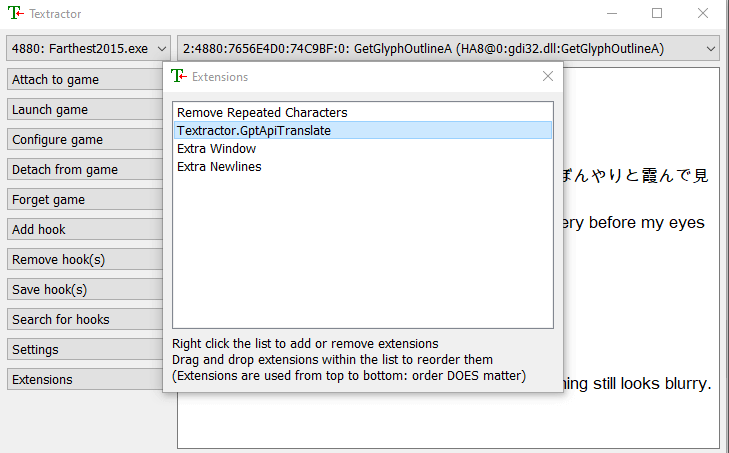
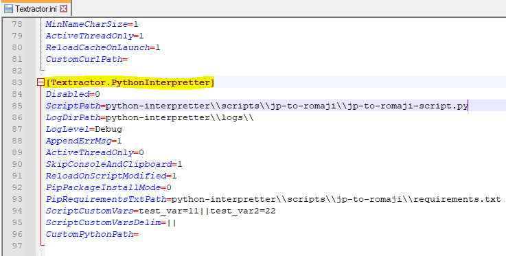

# Textractor.PythonInterpretter

This extension allows you to write and use python scripts in Textractor. This is essentially the equivalent of a python Textractor extension.

For those familiar with existing Textractor extensions, this extension was somewhat inspired by the Lua Interpretter extension.

Textractor extensions would normally be written in C++ (since that is the native code of the application). However, this extension serves as a middle man b/w Textractor and an underlying Python process to allow you to run your own python code in Textractor.


Under the hood, this extension is doing the following:
1. Creating a python process in the background.
2. Creating pipes b/w Textractor and this python process to transfer data.
3. Sentence data from Textractor is passed along these pipes to the python process.
4. The python process runs your designated python script functionality and processes any sentence data received from Textactor.
5. The output (updated sentence data) of the python functionality is passed back to Textractor.

<br>

**Note: The extension requires python scripts to be defined in a very specific way. Please follow the instructions in the [Creating a Textractor Python Script](creating-a-textractor-python-script) section for instructions on how to define your scripts.**

### How to Use (TL;DR):
1. Ensure [python >= v3.0](https://www.python.org/downloads/windows/) is installed on your machine.
2. Download extension (.xdll) and add to root Textractor directory
	- If you are planning to use more than one python script, then rename at least one of the '.xdll' extensions to a different name.
3. Add extension to Textractor at the right position in the extension list (the "right position" will depend on what the python script is meant to do).
4. Open Textractor.ini in a text editor, go to extension config section (will have same name as extension file), and set *ScriptPath* config value to the path of the python script you would like to run.
5. Create or download the desired python script to run. Ensure that its path matches the *ScriptPath* config value.
6. If needed, create or download the necessary "requirements.txt" file and set its path in the *PipRequirementsTxtPath* config value.
7. Adjust other config values as desired/needed: [Config Values](#config-values)
8. If you are a user who is not the developer of the python script, make sure you follow any additional instructions defined by the script's developer before using their script.

<br>

## Available Python Scripts
This repo comes with a few python scripts which you can use yourself.

All python scripts in this repo can be found [here](/scripts).

Any documentation for each script would be present on their corresponding page within this repo.


**List of scripts:**
1. **[Example Script](scripts/ScriptExample)**: Merely an example of how to implement a python script compatible with this extension.
	- Script file contains extensive documentation on script implementation details
	- The code itself merely prepends an incrementing number to the currently processed sentence.
2. **[JP to Romaji](scripts/JpToRomaji)**: Leverages NLP to append the romaji form of the currently processed sentence.

<br>

## How to Install
1. Ensure that python >= 3.0 is installed on your machine.
	- The core functionality of this extension relies on 3.x of python, thus 2.x versions of python are not compatible.
		- However, the necessary version of python will also depend on the functionality of the python script you will run. This can vary from script to script.
		- If you are not the script developer, make sure you reference any documentation from the developer to ensure that you are running the right version of python needed for their script.
	- Python can be downloaded [here](https://www.python.org/downloads/windows/).
2. Download the latest extension from Releases
    - https://github.com/voidpenguin-28/Textractor-ExtraExtensions/releases
3. Extract the zipped contents and place the '.xdll' extension in the root directory of the Textractor app.
	- Ensure that the chosen architecture matches the architecture of Textractor.
		- If you are using the x86 version of Textractor, then use the x86 extension
		- If you are using the x64 version of Textractor, then use the x64 extension
	- 
		- *The image uses a gpt extension as an example. In your case, you would be copying a "Textractor.PythonInterpretter.xdll" file.*
4. Add the extension to Textractor
	- An extension can be added by opening Textractor, pressing the "Extensions" button, right-clicking the extensions panel, then selecting 'Add extension'.
		- Add the '.xdll' from Textractor's root directory.
	- **Once the extension is added, the positioning of the extension in the extension list is important.**
		- An extension's order can be changed by clicking and dragging it.
			
		- The "right position" will depend on what the python script is meant to do. If you are not the developer of the extension and are unsure what position the extension should be placed, either reference the script developer's documentation or reach out to the script developer for further info.

<br>

## How to Use
1. Follow the instructions in the [How to Install](#how-to-install) section to ensure the extension is properly added to Textractor.
2. Once the extension has been added to Textractor, a default config section will be generated/added to the file "Textractor.ini", which you can use to configure this extension.
	- "Textractor.ini" is located in the root directory of the Textrator app and contains most app/extension config values.
	- Open "Textractor.ini" in a text editor (ex: Notepad, Notepad++)
	- The config section for this extension will match the name of the extension.
		- Ex: \[Textractor.PythonInterpretter\]
		- If you change the name of this extension, the generated/associated ini section name will match that name.
			- Ex: "Python-JpToRomaji.xdll" => \[Python-JpToRomaji\]
	- If you want to run more than one python script, simply make a copy of an existing PythonInterpretter extension (.xdll file) and give the copied extension a new name.
		- When the new extension is added to Textractor, a new config section will be added to Textractor.ini matching the name of the new extension.
		- From there, you can set the new extension's config section to point to a different python script.
3. Create or download the desired python script to run.
	- Ensure that the file path correctly matches the *ScriptPath* config value you set.
4. If needed, create or download the necessary "requirements.txt" file and set its path in the *PipRequirementsTxtPath* config value.
	- This is used to pre-install any needed python package depedencies before running the python script, if needed.
	- If you are not the script developer, and the developer does not provde a requirements.txt file with their script, then you should likely be fine without a 'requirements.txt' file.
5. Adjust the config section for this extension in the "Textractor.ini" file accordingly.
	- Reference the [Config Values](#config-values) section for each possible value to adjust.
		- The most important config value that must be set is the **ScriptPath** value, which specifies the python script to run. This extension will be disabled unless a script path is set.
	- 
6. If you are a user who is not the developer of the python script, make sure you follow any additional instructions defined by the script's developer before using their script.


<br>

## Creating a Textractor Python Script

There is only one requirement for running a python script in Textractor with this extension:
- The definition of a **process_sentence** function, which will be called by this extension to process/modify the current text being processed (for each thread/hook).

In addition to this, there are a few optional functions you can define which will be called by this extension under specific cirumstances:
- An **on_script_load** function, which will be called when this extension loads the python script
- An **on_script_unload** function, which will be called when this extension unloads the python script.

More thorough information on creating a script can be found in the **[following example script](scripts/ScriptExample/extension-script-ex.py)**. It is highly recommended you review this example script to fully understand how to create a python script that is properly compatible with this extension.


**Additional notes for python developers:**
1. It is your responsibility to ensure that your code is thread-safe.
	- Every single texthook being tracked by Textractor has its own dedicated thread, which will each be calling your python code whenever it receives text to process.
	- All of these threads will have access to the same global scope in your python code.
2. Make sure you properly cleanup any open or independently managed resources.
	- The option to implement an **on_script_unload** function exists for this reason: to give you the opportunity to clean up resources like this when your python script gets unloaded by this extension.
3. As stated in the example script, this extension also initializes a logger which you can use in your own script for logging messages.
	- It is a global variable called '*main_logger*', which leverages python's "logging" module.
		```python
		main_logger.info('This is a logging test...')
		```
	- '*main_logger*' will log to the extension's python log file.
	- Please try not to tamper with the logger or it could result in errors or unexpected behavior.
4. If you are developing scripts for other people to use, it is recommended you create sufficient documentation that clarifies the following:
	- What your script is supposed to do
	- Any necessary instructions for properly getting the script running.
		- This will include clarifying any potential additional files that may need to be downloaded alongside your script, such as a 'requirements.txt' file to ensure necessary python dependencies are installed on the user's machine.
	- Any details on how to diagnose/fix any common or expected issues with your script.
5. If you want your python code to only process sentences in the currently active thread/hook, the simplest way to implement it is to leverage the "*current select*" key of the *sentence_info* map that is passed to *process_sentence*.
	- *sentence_info['current select']* will be *0* if the current thread is *not* the active thread in the Textractor UI.
	- Therefore, simply return back the same sentence if the value is 0
	- Example:
		```python
		def process_sentence(sentence, sentence_info, custom_vars):
			# only process sentences on the current selected thread
			if not sentence_info['current select']:
				# not the current active thread, so simply return unmodified sentence
				return sentence
			
			# otherwise continue processing sentence here...
		```

<br>

## Config Values
Here is the list of currently supported config values for this extension.

1. **Disabled**: If set to '1', then no sentences will be processed through python.
	- Default value: '0' (python processing enabled)
2. **ScriptPath**: The file path of the python script to run with this extension.
	- Default value: '' (blank)
	- A blank value indicates that no script will be run.
	- This path should include the file itself, not just its directory.
		- Ex: "*python-interpretter/py-script.py*", not "*python-interpretter/*"
	- If you use backslashes in your path, **please double the backslashes**
		- Ex: '*python-interpetter\\\\py-script.py*' instead of '*python-interpetter\\py-script.py*'
		```ini
		[Textractor.PythonInterpretter]
		;;...omitted...
		ScriptPath=python-interpetter\\py-script.py
		;;...omitted...
		```
	- The following steps occur when a script is loaded:
		- If the LogLevel is "Debug", then you should get a popup message stating that a script is being loaded.
		- Before loading the python script, any required python package depedencies are installed first. You may see a black command window show up briefly while these dependencies are being installed.
		- Then the python script loads in the background.
		- If the LogLevel is "Debug", then you should get a popup message stating that the script has finished loading.
			- If the LogLevel is not "Debug", then the script would be considered loaded successfully if you do not get any error popups while the script is loading.
	- If this config value is changed at any point while the extension is active, then this extension will automatically unload the currently loaded script and load the new script based on the new ScriptPath.
		- Note: this script reload will occur the next time a sentence is received by Textractor, after the config value is changed.
		- If the LogLevel is at least "Info", then you should get a popup message indicating that a script reload is occuring due to a config change.
3. **LogDirPath**: The directory path to store all logs for this extension
	- Default value: '*python-interpretter\\\\logs\\\\*'
	- **Note: this should only be a directory path, not a path to a file**
		- Ex: "*python-interpretter/logs/*", not "*python-interpretter/logs/log.txt*"
	- If you use backslashes in your path, **please double the backslashes**
		- Ex: '*python-interpetter\\\\logs\\\\*' instead of '*python-interpetter\\logs\\*'
	- If the path you specify does not exist, this extension will automatically create it when the extension loads.
	- The following log files will get generated and written to:
		- **[*Extension-Name*]-client-init-fatal-log.txt**: This log will be used to write any fatal errors that occur when the python script attempts to first load.
			- This would capture any errors such as unexpected syntax errors when trying to run python, syntax errors in the python code itself, failures due to missing dependencies, and any other exceptions that occur during the initialization process.
			- Once the python script is loaded successfully, this log is no longer used and all other python-related logging will be written to the "client-log" instead.
		- **[*Extension-Name*]-extension-log.txt**: This is used to write any top-level logging from the extension itself.
			- This is log less concerned with the underlying python intercommunication process and more-so focused on functionality specific to the extension itself.
		- **[*Extension-Name*]-host-log.txt**: This is primarily focused on logging details regarding the python intercommunication process, from the host-side (the extension is the host of the intercommunication).
			- This will include logging details related to the creation/management of the python process, tracking the status of named pipes on the host-end, etc.
		- **[*Extension-Name*]-client-log.txt**: This is primarily focused on logging details regarding the python intercommunication process, from the client-side (the python process is the client of the intercommunication).
			- This will include logging details related to named pipe connection/disconnection, python thread management, exceptions that occur from python commands received from the host, general python process status, etc.
	- Note, this extension has some built-in log truncation functionality to prevent the logs from growing too big.
		- If any of the logs grow beyond 10MB, then when this extension is unloaded (ex: when Textractor is closed) the logs will be trimmed down to 10MB (with older messages being removed).
	- **Note that changes to this config value will only be recognized on Textractor restart or extension reload.**
4. **LogLevel**: The minimum log level that will be written to logs.
	- Default value: 'Info' (only "Info" and above log messages will be written to log).
	- Ex: If this value is "Warning" then only "Warning", "Error", and "Fatal" log messages will be written to log. "Debug" and "Info" messages will not be written.
	- Possible Log Levels:
		- **Debug**: Used for information that may be needed for diagnosing/troubleshooting issues or getting extended information to ensure everything is running smoothly.
			- The logs will show the exact cmd commands, python commands, and python output at every point while the extension is active.
			- At this log level, a popup message will be shown for when the python script starts loading and finished laoding when the extension is first loaded up. In other words, these popups will not show up if the log level is "Info" or higher.
			- Otherwise, this log level should generally not be used since it logs way more information than you'd likely need under normal circumstances.
		- **Info**: The standard log level simply logging basic activity that occurs, such as script loads/unloads & python process creation/termination.
			- The is generally the recommended minumum log level to keep.
		- **Warning**: Generally indicates that some unexpected problem/situation may have occurred, but is generally not significant enough to affect/interrupt the flow/functionality of the extension.
			- This could include a suddenly disconnected pipe (which the extension will simply attempt to recreate or reconnect), or an attempt to create/terminate a python process that already exists.
		- **Error**: Indicates when the extension encounters an issue with its functionality. 
			- This error may or may not be significant enough to cause the entire extension to become dysfunctional (however, in most cases this circumstance would be tied to a "Fatal" log message instead)
			- This may include failing to creating a python process (in which a reattempt to create the process may occur), an unhandled exception in an executed python command (any sentences that failed to process will simply return back the same unmodified sentence to Textractor), or a failure to recreate/reconnect a detached pipe.
			- For certain key errors, such as a script unexpectedly no longer being loaded, you should get an error popup indicating what the issue is and any potential actions the extension may be taking the fix it.
		- **Fatal**: Indicates that the extension encountered an event or entered a state in which some of its crucial functionality is not working, thus rendering the extension inoperable.
			- This may include cases where the python script completely fails to load, the python process failing to launch, or any required pipes failing to create/connect.
			- In most cases, you should get an error popup indicating that the extension has failed and will be disabled.
	- If you set an unrecognized value, then the log level will default to "Info".
5. **AppendErrMsg**: Provides the option to append any python error messages to the existing sentence being processed, if an error occurs.
	- Default value: '1' (append the error message)
	- If set to '0', then no python error messages will be appended to the current sentence (the sentence will simply be returned as-is).
		- Therefore, in this case if you want to know of any python errors that occurred, you will need to skim through the logs.
	- Ex: If the sentence being processed is "「……ってば―――」", and python runs into a 'not defined' exception while processing this sentence, then the following output sentence will be returned to Textractor:
		```
		「……ってば―――」
		[PYTHON ERROR] name 'sdfjkhsdfkh' is not defined
		```
6. **ActiveThreadOnly**: Indicates if only the current active/selected thread/hook should run python code.
	- Default value: '1' (Active thread/hook only).
	- If this value is set to 0, all threads/hooks will be run python code.
	- This merely provides an extension-level means for this functionality, even though the same functionality can technically be implemented at a python script level.
7. **SkipConsoleAndClipboard**: Allows you to exclude the Console and/or Clipboard threads from running python code.
	- Default value: '1' (skip Console and Clipboard threads)
	- Possible values:
		- **0**: Do not skip Console nor Clipboard threads
		- **1**: Skip both the Console and Clipboard threads
		- **2**: Skip the Console thread (but not the Clipboard thread)
		- **3**: Skip the Clipboard thread (but not the Console thread)
	- This setting applies regardless of the value of the *ActiveThreadOnly* config key.
	- This merely provides an extension-level means for this functionality, even though the same functionality can technically be implemented at a python script level.
8. **ReloadOnScriptModified**: Indicates whether the current python script should be reloaded if a modification to the script file is detected.
	- Default value: '1' (reload if script file change detected).
	- If set to '0', then the script will not be reloaded even if any changes to the current python script are found.
	- If the log level is at least "Info", then you should get a popup message indicating that the script is being reloaded due to a script change.
9. **PipPackageInstallMode**: Controls how the installation of python packages via pip should be handled.
	- Default value: '0' (skip package if already installed).
	- When a python script is loaded, this extension first installs python packages via pip for the following circumstances:
		- To ensure that all depedencies needed for the extension's core functionality are installed
		- To install dependencies needed for a particular python script (this will only occur if the *PipRequirementsTxtPath* config value is set).
	- Note that in all modes, packages that are not installed will be installed.
	- Possible Modes:
		- **0**: Always skip any packages that are already installed on the system, even if there are updates for a particular installed package.
		- **1**: Always check for updates for already installed packages and update the package if an update is found.
		- **2**: Always reinstall any already installed packages.
	- The mode should generally be set to '0' unless one of the following circumstances apply:
		- If specified otherwise by the developer of the python script.
		- If you are running into issues with the python script and suspect that the issue may be related to some of its dependencies.
	- **Note that changes to this config value will only be recognized on Textractor restart or extension reload.**
10. **PipRequirementsTxtPath**: Specifies a path to a 'requirements.txt' file to install necessary dependencies for a python script.
	- Default value: '' (blank, which means no requirements to install)
	- These dependencies are installed via 'pip' (which generally comes packaged with python installations).
	- These dependencies will be installed right before the python script is loaded.
	- You can specify either a file path to a specific 'txt' file, or simply specify a directory path.
		- File path example: '*python-interpetter/scripts/JpToRomaji/requirements2.txt*'
		- If you specify a directory path, then this extension will look for a 'requirements.txt' file in that directory.
			- Ex: Setting this config value to '*python-interpetter/scripts/JpToRomaji/*' would make the extension look for the file '*python-interpetter/scripts/JpToRomaji/requirements.txt*'
		- If you want the extension to look for a 'requirements.txt' file in the root Textractor directory, then simply assign '/' or '\\\\' to this config value.
			```ini
			[Textractor.PythonInterpretter]
			;;...omitted...
			PipRequirementsTxtPath=/
			;;...omitted...
			```
	- If you use backslashes in your path, **please double the backslashes**
		- Ex: '*python-interpetter\\\\scripts\\\\JpToRomaji\\\\*' instead of '*python-interpetter\\scripts\\JpToRomaji\\*'
	- For further information on the 'requirements.txt' file used by 'pip', such as how to define one, reference [pip's documentation on it](https://pip.pypa.io/en/stable/reference/requirements-file-format/).
11. **ScriptCustomVars**: Allows you to define custom variables that get passed to your python functions.
	- Default value: '' (blank, no custom variables provided)
	- In this config value, you can set a list of key-value pairs which will each represent an assigned variable.
		- Each key-value pair must be separated/delimited by the delimiter defined in the *ScriptCustomVarsDelim* config value.
		- Here is the expected structure of this config value:
			- <ins>*key1*</ins>=<ins>*value1*</ins>**delimiter**<ins>*key2*</ins>=<ins>*value2*</ins>**delimiter**<ins>*key3*</ins>=<ins>*value3*</ins>
			- Ex: The below config creates 3 custom variables (*a = "11", b = "22", c = "test1"*)
				```ini
				ScriptCustomVars=a=11||b=22||c=test1
				ScriptCustomVarsDelim=||
				```
	- These key-value pairs are assigned to the 'custom_vars' map, which is a parameter in the **process_sentence**, **on_script_load**, and **on_script_unload** functions.
		- Ex: If you define this config value as 'a=11||b=22||c=33', then the 'custom_vars' parameter will be defined as the following map: *{ "a": "11", "b": "22", "c": "33" }*
		- Then in your python functions, these variables can be accessed like a typical map
			- Ex: *var_a = custom_vars["a"] # 'var_a' will be assigned value "11"*
		- All keys and values will be treated as strings in the map.
12. **ScriptCustomVarsDelim**: The separator/delimiter to use to distinguish each key-value pair listed in the "ScriptCustomVars" config value.
	- Default value: '||'
	- If you changed this value to ';', then you would have to define the custom vars like so: '*key1=value1;key2=value2;key3=value3*'
13. **CustomPythonPath**: Specifies a custom directory path for where python (*python.exe*) is located/installed.
	- Default value: '' (blank value indicates to use system python path)
	- By default, this extension uses whatever python path that is specified by your system's PATH variable.
	- If you would like to use python from a different location (ex: portable version of python), then you can specify the directory path where python is located here.
	- Important notes:
		- **Note that changes to this config value will only be recognized on Textractor restart or extension reload.**
		- Only include the **directory** path, not the python executable itself.
			- Ex: '*C:/py-32/*' instead of '*C:/py-32/python.exe*'
		- If you use backslashes in your path, **please double the backslashes**
			- Ex: '*C:\\\\py-32\\\\*' instead of '*C:\\py-32\\*'
			```ini
			[Textractor.PythonInterpretter]
			;;...omitted...
			CustomPythonPath=C:\\py-32\\
			;;...omitted...
			```

<br>

**Full config example:**

```ini
[Textractor.PythonInterpretter]
Disabled=0
ScriptPath=
LogDirPath=python-interpretter\\logs\\
LogLevel=Info
AppendErrMsg=1
ActiveThreadOnly=0
SkipConsoleAndClipboard=1
ReloadOnScriptModified=1
PipPackageInstallMode=0
PipRequirementsTxtPath=
ScriptCustomVars=
ScriptCustomVarsDelim=||
CustomPythonPath=
```

