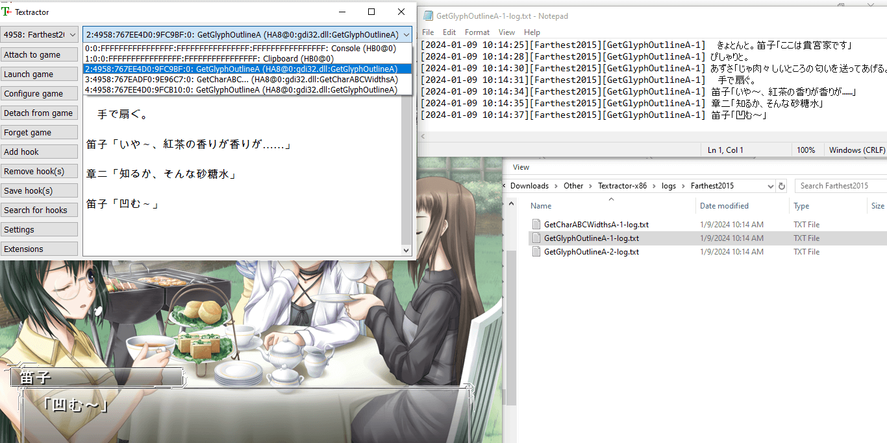
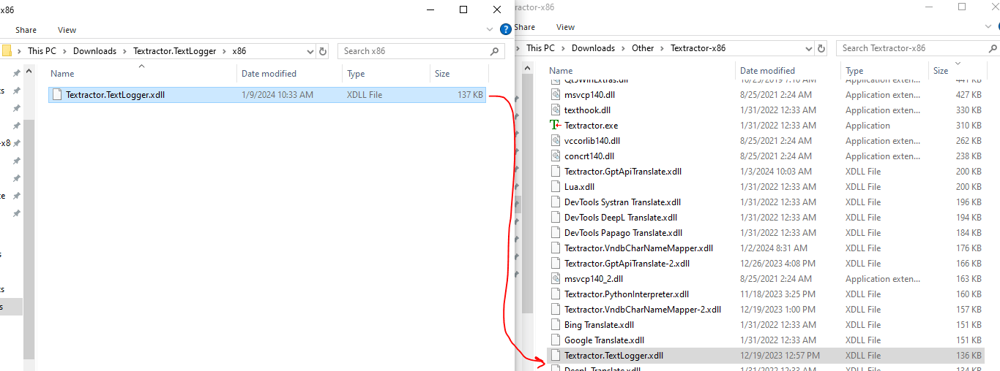
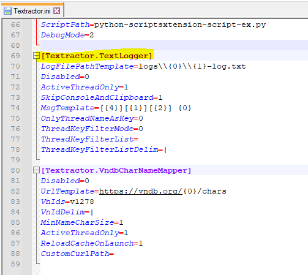
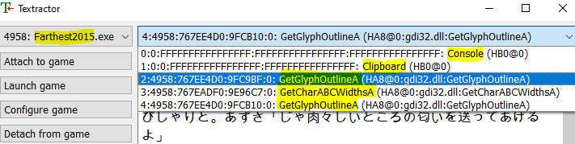
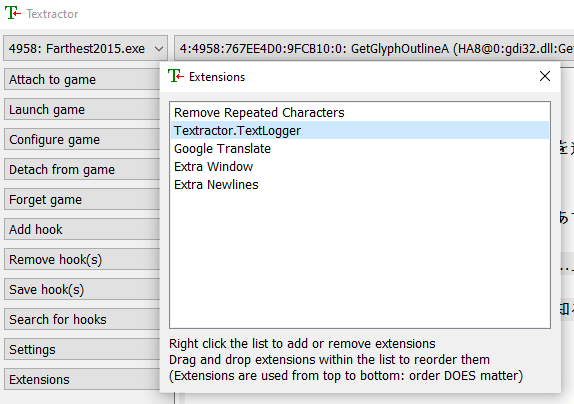
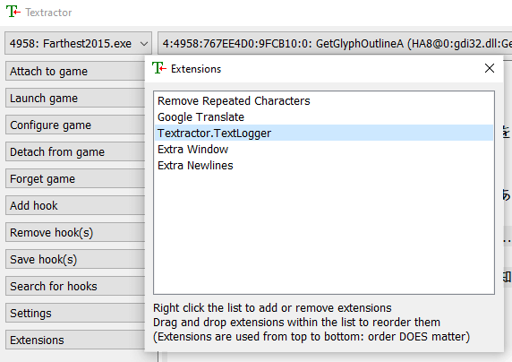

# Textractor.TextLogger

The purpose of this extension is to provide the capability to write text from each/any thread to a log file. This essentially allows you to export data/text piped by Textractor.

Among the features of this extension include:
1. Flexibility in how thread text is logged to files, such as writing each thread to a different file or writing all threads to the same file.
2. Flexibility in the structure of text written to logs, including logging details such as the thread name and current date for each message.
3. Capabilities to filter which threads to log data for.



#### How to Use (TL;DR):
1. Download extension (.xdll) and add to root Textractor directory
2. Add extension to Textractor at the desired position in the extension list. For further details, reference the [Notes](#notes) section.
3. Open Textractor.ini, go to extension config section, and adjust any config values as desired: [Config Values](#config-values)


## How to Install
1. Download the latest extension from Releases
    - https://github.com/voidpenguin-28/Textractor-ExtraExtensions/releases
2. Extract the zipped contents and place the '.xdll' extension in the root directory of the Textractor app.
	- Ensure that the chosen architecture matches the architecture of Textractor.
		- If you are using the x86 version of Textractor, then use the x86 extension
		- If you are using the x64 version of Textractor, then use the x64 extension
	- 
3. Add the extension to Textractor
	- An extension can be added by opening Textractor, pressing the "Extensions" button, right-clicking the extensions panel, then selecting 'Add extension'.
		- Add the 'Textractor.TextLogger.xdll' from Textractor's root directory.
	- **Once the extension is added, the positioning of the extension in the extension list will influence what text gets logged. Reference the [Notes](#notes) section for further details.**
		- An extension's order can be changed by clicking and dragging it.


## How to Use
1. Follow the instructions in the [How to Install](#how-to-install) section to ensure the extension is properly added to Textractor.
2. Once the extension has been added to Textractor, a default config section will be generated/added to the file "Textractor.ini", which you can use to configure this extension.
	- "Textractor.ini" is located in the root directory of the Textrator app and contains most app/extension config values.
	- Open "Textractor.ini" in a text editor (ex: Notepad, Notepad++)
	- The config section for this extension will match the name of the extension.
		- Ex: \[Textractor.TextLogger\]
		- If you change the name of this extension, the generated/associated ini section name will match that name.
			- Ex: "TextLogger.xdll" => \[TextLogger\]
3. Adjust the config section for this extension in the "Textractor.ini" file accordingly.
	- Reference the [Config Values](#config-values) section for each possible value to adjust.
	- 


## Notes
Before digging into each possible config value, a few concepts will be explained here.
1. **Process Name**: This refers to the name of the executable (.exe) of the current visual novel attached to Textractor.
	- This only includes the executable name, not the extension.
	- Ex: If the executable is "Clannad-Launch.exe", then the process name is "Clannad-Launch".
2. **Thread Name**: In this context, this refers to the main name of the output function tied to a particular text hook.
	- If you were to look at the dropdown menu of texthooks in Textractor, here's an example of how each one would map to a "thread name"
		- [*0:0:FFFFFFFFFFFFFFFF:FFFFFFFFFFFFFFFF:FFFFFFFFFFFFFFFF: Console (HB0@0)*] => **Console**
		- [*1:0:0:FFFFFFFFFFFFFFFF:FFFFFFFFFFFFFFFF: Clipboard (HB0@0)*] => **Clipboard**
		- [*2:4958:767EE4D0:9FC9BF:0: GetGlyphOutlineA (HA8@0:gdi32.dll:GetGlyphOutlineA)*] => **GetGlyphOutlineA**
		- [*3:4958:767EADF0:9E96C7:0: GetCharABCWidthsA (HA8@0:gdi32.dll:GetCharABCWidthsA)*] => **GetCharABCWidthsA**
		- [*4:4958:767EE4D0:9FCB10:0: GetGlyphOutlineA (HA8@0:gdi32.dll:GetGlyphOutlineA)*] => **GetGlyphOutlineA**
3. **Thread Key**: Almost the same as the thread name, however an index is suffixed to the end of the key to uniquely identify each instance of a particular thread name.
	- This is the primary value used to identify each thread by this extension.
	- The index increments for each instance of a thread name. This is tracked top-down from the order that text hooks are added/recognized to Textractor.
	- A dash is placed between the thread name and thread index (ex: *GetGlyphOutlineA-1*)
	- If you were to look at the dropdown menu of texthooks in Textractor, here's an example of how each one would map to a "thread key"
		- [*0:0:FFFFFFFFFFFFFFFF:FFFFFFFFFFFFFFFF:FFFFFFFFFFFFFFFF: Console (HB0@0)*] => **Console-1**
		- [*1:0:0:FFFFFFFFFFFFFFFF:FFFFFFFFFFFFFFFF: Clipboard (HB0@0)*] => **Clipboard-1**
		- [*2:4958:767EE4D0:9FC9BF:0: GetGlyphOutlineA (HA8@0:gdi32.dll:GetGlyphOutlineA)*] => **GetGlyphOutlineA-1**
		- [*3:4958:767EADF0:9E96C7:0: GetCharABCWidthsA (HA8@0:gdi32.dll:GetCharABCWidthsA)*] => **GetCharABCWidthsA-1**
		- [*4:4958:767EE4D0:9FCB10:0: GetGlyphOutlineA (HA8@0:gdi32.dll:GetGlyphOutlineA)*] => **GetGlyphOutlineA-2**

Below is an example of identifying the process name and thread names within Textractor.


#### Regarding Extension Order
Note that the order of Textractor extensions affect their behavior since each extension processes a sentence sequentially from the first to last extension.

Therefore, the position where this extension is placed in the extension list may change what text gets logged to file.

For example, placing this extension *before* any translation extensions will ensure that only Japanese text gets logged to file.


However, if you wanted to log translated text, you would have to place this extension *after* any translation extensions.



## Config Values
Please read the [Notes](#notes) section first, as concepts from there will be frequently referenced here.

<br>
Here is the list of currently supported config values for this extension.

1. **Disabled**: If set to '1', then the functionality of this extension will be disabled.
	- Default value: '0' (extension is enabled)
2. **LogFilePathTemplate**: This specifies both the path and file name structure of the log files that will be written.
	- Default value: 'logs\\\\{0}\\\\{1}-log.txt'
	- If the directory specified does not exist, it will be automatically created.
	- If you use backslashes in your path, **please double the backslashes**
		- Ex: 'logs\\\\{0}\\\\{1}-log.txt' instead of 'logs\\{0}\\{1}-log.txt'
	- The template allows for certain placeholder values which are substituted at runtime. These placeholders are simply indexes wrapped in curly brackets *\{ \}*
	- Supported Placeholder Values:
		- **{0}**: Process Name
			- Ex: If this config key is set to 'logs\\\\{0}\\\\log.txt' and process "Clannad-Launcher.exe" is attached to Textractor, then this extension will log data to: 'logs\\Clannad-Launcher\\log.txt'
		- **{1}**: Thread Key
			- Ex: If this config key is set to 'logs\\\\{1}-log.txt', then text from a text hook associated with thread key "*GetGlyphOutlineA-1*" will be logged to 'logs\\\\GetGlyphOutlineA-1-log.txt'
		- **{2}**: Thread Name
			- Ex: If this config key is set to 'logs\\\\{2}-log.txt', then text from a text hook associated with thread key "*GetGlyphOutlineA-1*" or "*GetGlyphOutlineA-2*" would both be logged to 'logs\\\\GetGlyphOutlineA-log.txt'
	- Here's a full example of how the default "LogFilePathTemplate" value would be mapped at runtime
		- If process "*Clannad-Launcher.exe*" is attached to Textractor and contains 3 thread keys (*GetGlyphOutlineA-1, GetCharABCWidthsA-1, GetGlyphOutlineA-2*), then the following log files will be generated (for default value 'logs\\\\{0}\\\\{1}-log.txt'):
			- *logs\\Clannad-Launcher\\GetGlyphOutlineA-1-log.txt*
			- *logs\\Clannad-Launcher\\GetCharABCWidthsA-1-log.txt*
			- *logs\\Clannad-Launcher\\GetGlyphOutlineA-2-log.txt*
3. **ActiveThreadOnly**: Indicates if this extension should only log data for the current active thread/hook.
	- Default value: '1' (only log current thread/hook)
	- If set to '0', all attached threads/hooks will be logged
4. **SkipConsoleAndClipboard**: Indicates if the Console and/or Clipboard threads should be excluding from logging.
	- Default value: '1' (skip Console and Clipboard threads)
	- Possible values:
		- **0**: Do not skip Console nor Clipboard threads
		- **1**: Skip both the Console and Clipboard threads
		- **2**: Skip the Console thread (but not the Clipboard thread)
		- **3**: Skip the Clipboard thread (but not the Console thread)
	- This setting applies regardless of the value of the *ActiveThreadOnly* config key.
5. **MsgTemplate**: Indicates the structure of each message logged to a file.
	- Default value: '\[\{4\}\]\[\{1\}\]\[\{2\}\] \{0\}'
	- This allows you to include additional details within a logged line beyond just the line itself.
		- In addition, it allows you to structure/order the details written.
	- The template allows for certain placeholder values which are substituted at runtime. These placeholders are simply indexes wrapped in curly brackets *\{ \}*
	- Supported Placeholder Values:
		- **{0}**: The text being written from the thread/hook.
			- Ex: If this config key is set to '{0}' and the line of text received is '凹む～'. Then simply '凹む～' will be written to the log.
		- **{1}**: Process Name
			- Ex: If this config key is set to '{1}: {0}' and process "*Clannad-Launcher.exe*" is attached to Textractor, then 'Clannad-Launcher: 凹む～' will be written to the log.
		- **{2}**: Thread Key
			- Ex: If this config key is set to '{2}: {0}' and text from a text hook associated with thread key "*GetGlyphOutlineA-1*" is being written, then 'GetGlyphOutlineA-1: 凹む～' will be written to the log.
		- **{3}**: Thread Name
			- Ex: If this config key is set to '{3}: {0}' and text from a text hook associated with thread key "*GetGlyphOutlineA-1*" is being written, then 'GetGlyphOutlineA: 凹む～' will be written to the log.
		- **{4}**: Current Date Time
			- Will log the current datetime on your system at the moment the data is written to the log.
			- Structure: %Y-%m-%d %H:%M:%S
				- YYYY-MM-DD hh:mm:ss
			- Ex: If this config key is set to '{4}; {0}' and the text is being written on Jan 9 2024 at 11:30am, then '2024-01-09 11:30:00; 凹む～' will be written to the log.
	- Here's a full example of how the default "MsgTemplate" value would be mapped at runtime
		- If process "*Farthest2015.exe*" is attached to Textractor and contains 3 thread keys (*GetGlyphOutlineA-1, GetCharABCWidthsA-1, GetGlyphOutlineA-2*), then here are some examples of the kinds of messages that will be written (for default value '\[\{4\}\]\[\{1\}\]\[\{2\}\] \{0\}'):
			- *[2024-01-09 10:14:25][Farthest2015][GetGlyphOutlineA-1] 　きょとんと。笛子「ここは貴宮家です」*
			- *[2024-01-09 10:14:28][Farthest2015][GetCharABCWidthsA-1] ぴしゃりと。*
			- *[2024-01-09 10:14:30][Farthest2015][GetGlyphOutlineA-2]  あずさ「じゃ肉々しいところの匂いを送ってあげるよ」*
			- *[2024-01-09 10:14:31][Farthest2015][GetGlyphOutlineA-1] 　手で扇ぐ。*
6. **OnlyThreadNameAsKey**: Indicates whether to just use the thread name as the thread key.
	- Default value: '0' (do not use thread name as key)
	- In other words, if this is enabled, if 3 threads would normally be named under thread keys ('GetGlyphOutlineA-1', 'GetGlyphOutlineA-2', 'GetGlyphOutlineA-3'), then they would all simply map to the same thread key of 'GetGlyphOutlineA' instead.
	- This can be useful for grouping together different threads with the same name without having to modify any of your template config values.
7. **ThreadKeyFilterMode**: Indicates the filter mode used by the config key "ThreadKeyFilterList"
	- Default value: '0' (disabled)
	- Supported Filter Modes:
		- **0**: Disabled. No filtering will occur, regardless if the "ThreadKeyFilterList" config value is set.
		- **1**: Blacklist mode. Any thread names or thread keys specified in the ThreadKeyFilterList will be excluded from logging.
		- **2**: Whitelist mode. Only thread names or thread keys specified in the ThreadKeyFilterList will be logged.
8. **ThreadKeyFilterList**: A list of thread names or thread keys to filter by.
	- The type of filtering is determined by the "ThreadKeyFilterMode" config value.
	- The list can include both thread keys and thread names.
		- In other words, if thread name "GetGlyphOutlineA" is included in the list, then all thread keys that full under that thread name would be automatically included.
	- Each thread name/key must be separated by the separator/delimiter specified in the "ThreadKeyFilterListDelim" config value.
		-Ex: If "ThreadKeyFilterListDelim" is set to '|', then the 3 threads can be added to the filter list like so: '*GetGlyphOutlineA-1|GetCharABCWidthsA|GetGlyphOutlineA-2*'
9. **ThreadKeyFilterListDelim**: The separator/delimiter to use to distinguish each thread key/name listed in the "ThreadKeyFilterMode" config value.
	- Default value: '|'
	- If you changed this value to ';', then you would have to define the filter list like so: '*GetGlyphOutlineA-1;GetCharABCWidthsA;GetGlyphOutlineA-2*'


<br>
Full config example:

```ini
[Textractor.TextLogger]
LogFilePathTemplate=logs\\{0}\\{1}-log.txt
Disabled=0
ActiveThreadOnly=0
SkipConsoleAndClipboard=1
MsgTemplate=[{4}][{1}][{2}] {0}
OnlyThreadNameAsKey=0
ThreadKeyFilterMode=1
ThreadKeyFilterList=GetGlyphOutlineA|GetGlyphOutlineA-2
ThreadKeyFilterListDelim=|
```
