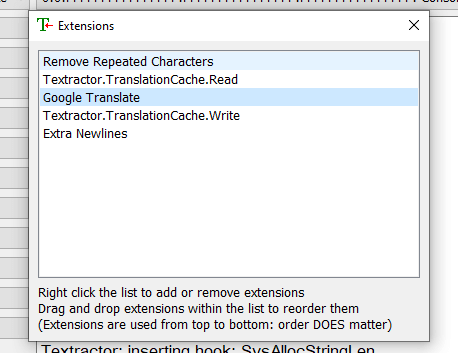

# Textractor.TranslationCache

These pair of extensions provide a means of caching real-time translations from translation extensions (ex: Google Translate, GptApiTranslate), thus skipping over any translation processes if a translation is already available in the local cache. 

These extensions are designed to be **"translation extension"-agnostic**, in other words it is designed to work with any translation extension. **However, please read the "How to Use" section and following instructions carefully to use these extensions correctly.**

Here are the two primary benefits/uses of the TranslationCache extensions
1. To enable caching features in translation extensions that do not have native caching capabilities (ex: [GptApiTranslate](https://github.com/voidpenguin-28/Textractor-ExtraExtensions/tree/main/Textractor.GptApiTranslate))
2. To allow you to use a centralized cache across all translation extensions, even if you are using one that has built-in caching capabilities.
	- This extension has been tested and confirmed to work with the following translation extensions: *Bing Translate, DeepL Translate, DevTools DeepL Translate, Google Translate, GptApiTranslate*

<br>

**This functionality involves the use of 2 extensions:**
1. **TranslationCache.Read**: Handles checking if the cache already contains a translation and indicating to the translation extension if a translation should be generated.
2. **TranslationCache.Write**: Handles retrieving the translation from cache and displaying it in Textractor, as well as writing a translation to cache if one was not previously found.

**Both of these extensions must be downloaded and added to Textractor. Adding/using only one of these extensions will not work correctly and may result in unexpected behavior.**

<br>

Behind the scenes, these extensions are simply maintaining their own cache file (by default named "Textractor.TranslationCache.txt", which can be adjusted via config). The "Read" and "Write" extensions leverage a shared memory cache to pass data to each other. The "SkippingStrategy" config option determines how these extensions signal to the translation extension that a translation should not be generated if it already exists in the cache.

Just as most translations extension operate, the output of these cache extensions will be both the original line as well as the translated line, separated by a new line.


<br>

#### How to Use (TL;DR):
1. Download **both the "Read" and "Write" extensions** (.xdll) and add to root Textractor directory
2. Add the extensions to Textractor at the right position
	- The "Read" extension should be added **right before** the translation extension.
	- The "Write" extension should be added **right after** the translation extension.
3. Open Textractor.ini in a text editor, go to extension config section [Textractor.TranslationCache], and set the correct **SkippingStrategy** config value based on which translation extension you are currently using. Reference the [Config Values](#config-values) for all possible values.
4. Adjust other config values as desired: [Config Values](#config-values)
	- You can use the "DebugMode" config value to confirm that the caching functionality is working correctly. The Textractor output will display "FROM CACHE:" if the translation was retrieved from cache.

<br>

## How to Install
1. Download the latest extension from Releases
    - https://github.com/voidpenguin-28/Textractor-ExtraExtensions/releases
2. Extract the zipped contents and place **both the "Read" and "Write"** '.xdll' extension in the root directory of the Textractor app.
	- Ensure that the chosen architecture matches the architecture of Textractor.
		- If you are using the x86 version of Textractor, then use the x86 extension
		- If you are using the x64 version of Textractor, then use the x64 extension
	- 
		- *The image uses a gpt extension as an example. In your case, you would be copying the "Textractor.TranslationCache.Read.xdll" and "Textractor.TranslationCache.Write.xdll" files.*
3. Add the extension to Textractor
	- An extension can be added by opening Textractor, pressing the "Extensions" button, right-clicking the extensions panel, then selecting 'Add extension'.
		- Add the 'Textractor.TranslationCache.Read.xdll' and 'Textractor.TranslationCache.Write.xdll' from Textractor's root directory.
	- **Once the extension is added, the positioning of the extension in the extension list is important.**
		- The "Read" extension should be added **right before** the translation extension.
		- The "Write" extension should be added **right after** the translation extension.
		- An extension's order can be changed by clicking and dragging it.
		- 


## How to Use
1. Follow the instructions in the [How to Install](#how-to-install) section to ensure the extension is properly added to Textractor.
2. Once the extension has been added to Textractor, a default config section will be generated/added to the file "Textractor.ini", which you can use to configure this extension.
	- "Textractor.ini" is located in the root directory of the Textrator app and contains most app/extension config values.
	- Open "Textractor.ini" in a text editor (ex: Notepad, Notepad++)
	- The default config section for this extension will be *Textractor.TranslationCache*.
		- Ex: \[Textractor.TranslationCache\]
		- However, you can rename the extension if you'd like, as long as they maintain the following structure:
			- *CustomName*.Read.xdll, *CustomName*.Write.xdll
			- The *CustomName* must match between the two extension. Then the *CustomName* will be used as the config section name in the Textractor.ini file
				- Ex: "CustCache.Read.xdll" and "CustCache.Write.xdll" would generate/use the config section name [CustCache]
3. Adjust the config section for this extension in the "Textractor.ini" file accordingly.
	- Reference the [Config Values](#config-values) section for each possible value to adjust.
		- The most important config value that must be set is the **SkippingStrategy** value. This extension will not work unless the correct SkippingStrategy is set.
		- The SkippingStrategy determines the way in which these caching extensions signals to the translation extension to skip the translation process if an entry already exists in the cache.
	- 

<br>

## Config Values
Here is the list of currently supported config values for this extension.

1. **Disabled**: Allows you to disable all or some of these extensions' functionality.
	- Default value: '0' (extension is fully enabled)
	- Possible values:
		- **0**: Fully enabled
		- **1**: Fully disabled (no reading from cache, no writing to cache)
		- **2**: Read-only (text will be read from cache, but no text will be written to cache.
2. **CacheFilePath**: Determines where the cache file will be stored.
	- Default value: '' (written to root Textractor directory)
	- You can specify just a directory or you can specify a specific file name for cache.
		- If this config value does not end in a '.txt', then it will be interpretted as a directory path.
		- If a directory path is used, then the cache file name will default to 'Textractor.TranslationCache.txt'
		- If the config value path ends in a '.txt' then that exact name will be used as the cache file name.
	- Important notes
		- **Changes to this value will only be recognized on extension reload or Textractor restart.**
		- As long as these extension are open, the cache file will be locked from being changed by an external source. If you want to modify the cache file, you will need to unload the extensions or close Textractor first.
		- If you use backslashes in your path, **please double the backslashes**
			- Ex: '*cache\\\\*' instead of '*cache\\*'
3. **SkippingStrategy**: Determines how these cache extensions should signal to the translation extension that no translation should be generated (in cases where a translation was found in the cache).
	- Default value: 0 (send zero-width space)
	- **This config value must be set correctly based on which translation extension is being used, otherwise caching capabilities may not work properly.**
		- Different translation extension have different conditions in which they will skip the translation process. Therefore, you must ensure that the SkippingStrategy you use is compatible with the translation extension being used.
	- Possible values:
		- **0**: Send Zero-Width Space
			- The caching extensions will add a zero-width space to the text passed to the translation extension.
			- Some translation extensions may skip translation if a zero-width space is present in the text.
			- Compatible extensions: *GptApiTranslate* (as long as the 'SkipIfZeroWidthSpace' config value is set to 1)
		- **1**: Exceed Text Length Limit
			- The caching extensions will send a 10,000 character random string to the translation extension.
			- Most translation extensions have a text size limit in which they will not translate text that exceeds that limit.
			- Compatible extensions: *Bing Translate, DeepL Translate, DevTools DeepL Translate, Google Translate*
		- **2**: Send Dummy Text
			- The translation extensions will always sends the text "TRANS_CACHE_DUMMY_VAL" to the translation extension.
			- This will only be useful if you are using a translation extension with built-in caching capabilities (and must be enabled).
			- The idea here is after the 1st time the translation extension sees the dummy string, it will always retrieve that dummy string from its own cache every other time it sees that same text.
			- Compatible extensions: any extensions with built-in and enabled caching capabilities (ex: *Bing Translate, DeepL Translate, DevTools DeepL Translate, Google Translate*)
4. **ActiveThreadOnly**: Indicates if only the current active/selected thread/hook should leverage caching (reading & writing).
	- Default value: '1' (Active thread/hook only).
	- If this value is set to 0, all threads/hooks will leverage caching.
5. **SkipConsoleAndClipboard**: Allows you to exclude the Console and/or Clipboard threads from leveraging caching (reading & writing).
	- Default value: '1' (skip Console and Clipboard threads)
	- Possible values:
		- **0**: Do not skip Console nor Clipboard threads
		- **1**: Skip both the Console and Clipboard threads
		- **2**: Skip the Console thread (but not the Clipboard thread)
		- **3**: Skip the Clipboard thread (but not the Console thread)
	- This setting applies regardless of the value of the *ActiveThreadOnly* config key.
6. **CacheFileLimitMb**: Determines the size limit, in megabytes (MB), of the cache file.
	- Default value: 16.0 (16 MB)
	- Note: If the file size exceeds this limit, the cache file will only be trimmed once the cache extensions are unloaded or Textractor is closed.
	- The trimming process involves deleting lines from the beginning of the cache until the file cache size goes just below the assigned limit.
7. **CacheLineLengthLimit**: If the current text's length exceeds this limit (number of characters), then it will not be written to cache.
	- Default value: 500 (500 characters)
	- Note that the number of characters evaluated includes the total length of the original text and translated text together.
8. **ClearCacheOnUnload**: If set to '1', fully clears the entire cache file when the cache extensions are unloaded or when Textractor is closed.
	- Default value: '0' (do not clear cache on unload)
9. **ThreadKeyFilterMode**: Indicates the filter mode used by the config key "ThreadKeyFilterList"
	- Default value: '0' (disabled)
	- Supported Filter Modes:
		- **0**: Disabled. No filtering will occur, regardless if the "ThreadKeyFilterList" config value is set.
		- **1**: Blacklist mode. Any thread names or thread keys specified in the ThreadKeyFilterList will be excluded from caching functionality.
		- **2**: Whitelist mode. Only thread names or thread keys specified in the ThreadKeyFilterList will be leveraging caching functionality.
10. **ThreadKeyFilterList**: A list of thread names or thread keys to filter by.
	- For info on what a "ThreadKey" is, reference the following Notes section:
		- https://github.com/voidpenguin-28/Textractor-ExtraExtensions/tree/main/Textractor.TextLogger#notes
	- Note that filtering related config values are usually only relevant when config key **ActiveThreadOnly** is set to '0'.
	- The type of filtering is determined by the "ThreadKeyFilterMode" config value.
	- The list can include both thread keys and thread names.
		- In other words, if thread name "GetGlyphOutlineA" is included in the list, then all thread keys that full under that thread name would be automatically included.
	- Each thread name/key must be separated by the separator/delimiter specified in the "ThreadKeyFilterListDelim" config value.
		-Ex: If "ThreadKeyFilterListDelim" is set to '|', then the 3 threads can be added to the filter list like so: '*GetGlyphOutlineA-1|GetCharABCWidthsA|GetGlyphOutlineA-2*'
11. **ThreadKeyFilterListDelim**: The separator/delimiter to use to distinguish each thread key/name listed in the "ThreadKeyFilterMode" config value.
	- Default value: '|'
	- If you changed this value to ';', then you would have to define the filter list like so: '*GetGlyphOutlineA-1;GetCharABCWidthsA;GetGlyphOutlineA-2*'
12. **DebugMode**: If set to '1', "FROM CACHE:" will be added to the beginning of the text displayed in Textractor, in cases where the translation was retrieved from cache.
	- Default value: '0' (debug mode disabled)
	- If no translation was retrieved from cache, then the text will simply be returned as normal (no prepended message).
	- This is an easy way to test if the caching extensions are working as expected.

<br>

**Full config example:**

```ini
[Textractor.TranslationCache]
Disabled=0
CacheFilePath=
SkippingStrategy=0
ActiveThreadOnly=1
SkipConsoleAndClipboard=1
CacheFileLimitMb=16.0
CacheLineLengthLimit=500
ClearCacheOnUnload=0
ThreadKeyFilterMode=0
ThreadKeyFilterList=
ThreadKeyFilterListDelim=|
DebugMode=0
```
