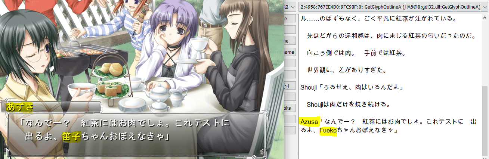
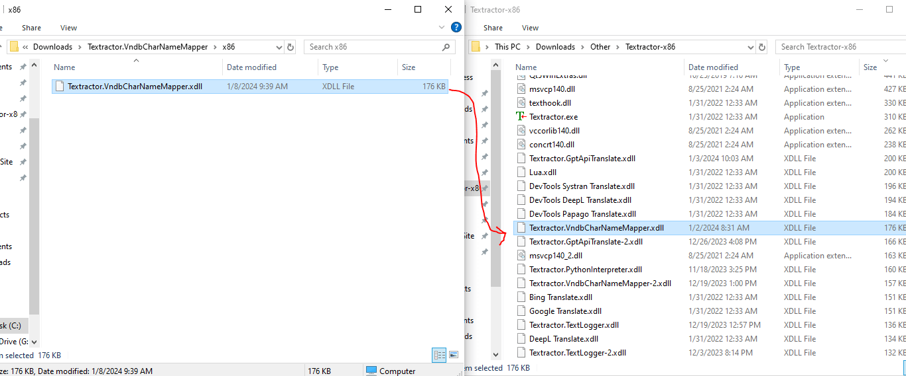
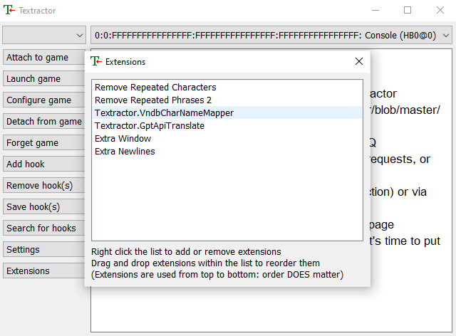
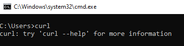
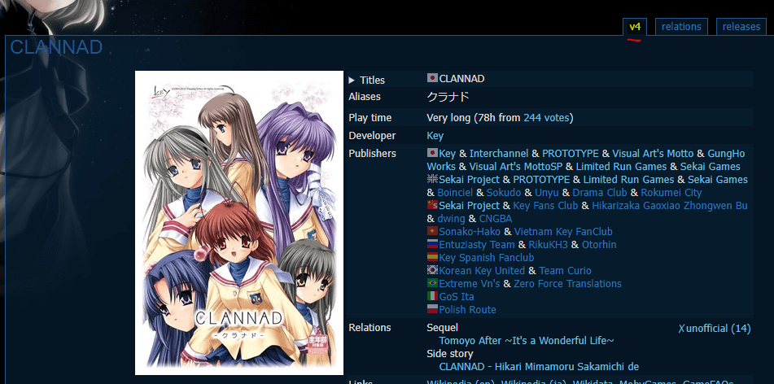

# Textractor.VndbCharNameMapper

The purpose of this extension is to help ensure that the Japanese names of characters are translated properly into English without needing to resort to maintaining your own manual list of name mappings.

This sometimes may be necessary to translate certain names properly since the kanji for some Japanese names have multiple different ways they can be read/interpretted. As a result, translation tools may end up translating a name incorrectly.

This extension will automatically retrieve the Japanese and English names of all known characters for a specified visual novel from https://vndb.org (popular visual novel database site). Each sentence received by Textrator will then be checked if a particular character name is found and will auto-translate it into its English equivalent, based on an appropriate name mapping.



The following are auto-translated:
* Full names (first & last name)
* First names
* Last names
<br>

#### How to Use (TL;DR):
1. Download extension (.xdll) and add to root Textractor directory
2. Add extension to Textractor at the right position (*after* text fixes extensions, *before* translator/display extensions)
3. Open Textractor.ini, go to extension config section, and set *VnIds* config value to the vndb visual novel identifiers of the visual novels you would like to map names for.
4. Adjust other config values as desired: [Config Values](#config-values)

<br>

**Note:**
<br>
**This extension will retrieve the names of all characters listed on vndb for the specified visual novel. *This will include all characters marked under "spoilers"*.**
<br><br>
**Therefore, if you do not want to be spoiled about the existence of certain characters, *do not look at this extension's cache file (Textractor.VndbCharNameMapper.ini)*.**
<br><br>
**In addition, if a certain character's name is not translated, then it is most likely because that character's name is not present on vndb's character list for that visual novel.**

## How to Install
1. Download the latest extension from Releases
    - https://github.com/voidpenguin-28/Textractor-ExtraExtensions/releases
2. Extract the zipped contents and place the '.xdll' extension in the root directory of the Textractor app.
	- Ensure that the chosen architecture matches the architecture of Textractor.
		- If you are using the x86 version of Textractor, then use the x86 extension
		- If you are using the x64 version of Textractor, then use the x64 extension
	- 
3. Add the extension to Textractor
	- An extension can be added by opening Textractor, pressing the "Extensions" button, right-clicking the extensions panel, then selecting 'Add extension'.
		- Add the 'Textractor.Textractor.VndbCharNameMapper.xdll' from Textractor's root directory.
	- **Once the extension is added, the positioning of the extension in the extension list is important.**
		- Make sure this extension is placed **after** any text fix extensions.
			- Ex: "Remove Repeated Characters", "Remove Repeated Phrases", etc.
		- Also make sure this extension is placed **before** any translation or display-related extensions.
			- Ex: "Google Translate", "DevTools DeepL Translate", "Extra Window", "Extra Newlines", etc.
		- An extension's order can be changed by clicking and dragging it.
		- 
4. **This extension relies on *curl.exe* to perform network requests to vndb. Ensure that curl is installed on your machine.**
	- **curl** is already installed/available on [all versions of Windows 11] & [Windows 10 ver.1803 or later].
		- Versions of curl pre-packaged with Windows can be found here: C:\Windows\System32\curl.exe
	- A quick way to test if curl is installed/available is to open a command prompt (cmd.exe), then simply type "curl".
		- If curl is found, you should get a message like "*curl: try 'curl --help' for more information*"
		- If curl is not found, you should get a message like "*'curl' is not recognized as an internal or external command,
operable program or batch file.*"
		- 
	- If you do not have curl on your machine, you can download/install it from here: https://curl.se/download.html#Win32
	- If you would like to use a portable version of curl with this extension, you can configure a custom curl path for the extension to use. Reference the [Config Values](#config-values) section of this document for further details.


## How to Use
1. Follow the instructions in the [How to Install](#how-to-install) section to ensure the extension is properly added to Textractor.
2. Once the extension has been added to Textractor, a default config section will be generated/added to the file "Textractor.ini", which you can use to configure this extension.
	- "Textractor.ini" is located in the root directory of the Textrator app and contains most app/extension config values.
	- Open "Textractor.ini" in a text editor (ex: Notepad, Notepad++)
	- The config section for this extension will match the name of the extension.
		- Ex: \[Textractor.VndbCharNameMapper\]
		- If you change the name of this extension, the generated/associated ini section name will match that name.
			- Ex: "VndbNameMapper.xdll" => \[VndbCharNameMapper\]
3. Adjust the config section for this extension in the "Textractor.ini" file accordingly.
	- Reference the [Config Values](#config-values) section for each possible value to adjust.
		- The most important config value that must be adjusted is the **VnIds** value.
	- 

## Config Values
Here is the list of currently supported config values for this extension.

1. **Disabled**: If set to '1', then the functionality of this extension will be disabled.
	- Default value: '0' (extension is enabled)
2. **UrlTemplate**: Specifies the core url to use for retrieving character names from vndb.
	- Default value: 'https://vndb.org/{0}/chars'
	- '{0}' indicates the position of the visual novel identifier to use.
		- Ex: If the visual novel id is 'v4', then "https://vndb.org/{0}/chars" will map to "https://vndb.org/v4/chars"
		- **Under normal cirumstances, this value should NOT be modified, or it could result in broken or unexpected behavior.**
			- This config value exists in case a future issue/cirumstance presents itself if vndb ever changed how it structures its urls/paths.
3. **VnIds**: A list of vndb visual novel identifiers, which are used to indicate which visual novels to map character names for.
	- **This is the most important config value to set. This value is blank by default, thus there is no targeted visual novel.**
	- vndb has a numeric identifier for every visual novel on the site.
		- This identifier can primarily be found in 2 places
			1. In the url for a visual novel entry: "[https://vndb.org/**v4**](https://vndb.org/v4)"
			2. The name of the primary tab of the visual novel entry. 
	- Add the visual novel identifiers for all visual novels you would like to map names for.
		- Ex: If you wanted to map names for the visual novel "Clannad", you would assign the value "v4" to "VnIds"
		```ini
		[Textractor.VndbCharNameMapper]
		;;...omitted...
		VnIds=v4
		;;...omitted...
		```
		- You can map multiple visual novels by specifying multiple visual novel identifiers, separated by the character specified in the config value "VnIdDelim" (default delimiter is '|')
			- Ex: If you wanted to map names for "Clannad" or "Umineko", you would assign "v4|v24". "v4" is the id for Clannad, "v24" is the id for Umineko.
			```ini
			[Textractor.VndbCharNameMapper]
			;;...omitted...
			VnIds=v4|v24
			;;...omitted...
			```
4. **VnIdDelim**: The delimiter/separator to use when specifying more than one visual novel identifier in the "VnIds" config value.
	- The default value is '|', thus each identifier should be separated by a '|' . (Ex: *VnIds=v4|v24*)
	- If you changed the "VnIdDelim" value to ';', then each visual novel identifier would need to be separated by a semi-colon. (Ex: *VnIds=v4;v24*)
	```ini
	[Textractor.VndbCharNameMapper]
	;;...omitted...
	VnIds=v4;v24
	VnIdDelim=;
	;;...omitted...
	```
5. **MinNameCharSize**: The minimum number of Japanese characters that must be present in a name.
	- If a character's name is less than this number, then that name will not get mapped.
	- Default value: '2'
	- Ex: If this value is set to '2' and a character has a first or last name that is only 1 JP character long (ex: 杏), then that name will not get mapped to English.
	- This config value exists to reduce potential false positives in certain cirumstances. For example, if a character's name is 杏, but a sentence uses the kanji 杏 within other non-name words, then that would result in an incorrect JP=>EN mapping.
		- If you are not concerned about false positives, then you can simply adjust this value to '1', and thus all names will get mapped regardless of length.
6. **ActiveThreadOnly**: Indicates if this extension should only map names for the currently selected thread in Textractor.
	- Default value: '1' (map current thread only)
	- If set to '0', then this extension will attempt to map names for all threads.
		- However, the Console & Clipboard threads are always excluded from name mapping, regardless of this config value.
7. **ReloadCacheOnLaunch**: Determines whether to reload the character name mapping cache each time Textractor is launched.
	- Default value: '0' (do not reload)
	- When this extension retrieves name mappings for a visual novel from vndb, it then caches them to a cache file called "\*\*ExtensionName\*\*.ini" (ex: *Textractor.VndbCharNameMapper.ini*).
		- Name mappings are retrieved from this cache file before attempting to make a network request to vndb. This is to reduce the number of unneeded network requests your system makes to vndb.
		- By default, once name mappings for a specific visual novel are cached to this file, name mappings will always be retrieved from cache instead of from vndb.
	- Therefore, by setting this config value to '1', each time Textractor is launched, the file cache will be reloaded from vndb.
		- This can be useful for visual novel entries in vndb that may be constantly updated, such as recently released visual novels.
		- Thus this helps ensure that the list of characters is up-to-date.
8. **CustomCurlPath**: Specifies a custom directory path for where *curl.exe* is located.
	- Default value: '' (blank value indicates to use system curl path)
	- As previously stated, curl is necessary for this extension to perform network requests.
	- By default, this extension uses whatever curl path that is specified by your system's PATH variable.
	- If you would like to use curl from a different location (ex: portable version of curl), then you can specify the directory path where curl is located here.
	- Important notes:
		- Only include the **directory** path, not the curl executable itself.
			- Ex: '*C:/curl-win/*' instead of '*C:/curl-win/curl.exe*'
		- If you use backslashes in your path, **please double the backslashes**
			- Ex: '*C:\\\\curl-win\\\\*' instead of '*C:\\curl-win\\*'
			```ini
			[Textractor.VndbCharNameMapper]
			;;...omitted...
			CustomCurlPath=C:\\curl-win\\
			;;...omitted...
			```
<br>
Full config example:

```ini
[Textractor.VndbCharNameMapper]
Disabled=0
UrlTemplate=https://vndb.org/{0}/chars
VnIds=v4|v24
VnIdDelim=|
MinNameCharSize=1
ActiveThreadOnly=1
ReloadCacheOnLaunch=1
CustomCurlPath=
```